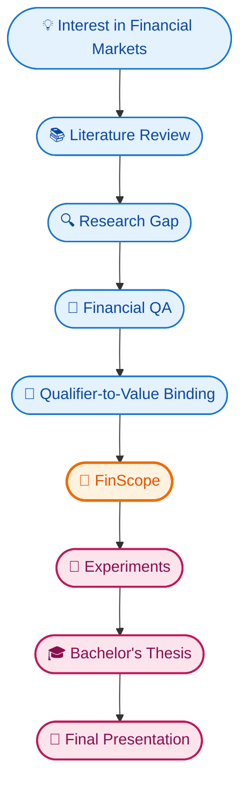

# Undergraduate Thesis - Bachelor's Project

## From Financial Markets to FinScope

### A Bachelor's Research Journey in Financial AI, Financial QA, and Intelligent Financial Systems

<p align="center">
  
</p>

<p align="center">
  <b>University of Isfahan<br>Faculty of Computer Engineering<br>Department of Artificial Intelligence Engineering</b>
</p>

<p align="center">
  <i>From an interest in financial markets to a research project in Financial AI</i>
</p>

---

# The Story Behind the Project

This repository is not just a collection of files from a Bachelor's project.

It is the story of how an initial interest in **financial markets** gradually turned into a research direction, a literature review, a research collaboration, the **FinScope** framework, research papers, and eventually a Bachelor's thesis and final presentation.

The journey did not begin with FinScope.

It began with a simple interest:

> **How can Artificial Intelligence be used to understand and analyze financial markets?**

That question led to independent exploration, conversations with researchers, reading academic work, and eventually a much more specific research problem.

The path looked roughly like this:

## 🛤️ My Research Journey

> *From a spark of curiosity to a defended thesis — a 20-month journey through research, collaboration, and discovery.*

---

### 📊 Phase Breakdown

<div align="center">
<table align="center">
  <thead>
    <tr>
      <th style="background:#FF9800; color:#fff; padding:10px;">🌱 Phase</th>
      <th style="background:#2196F3; color:#fff; padding:10px;">📅 Period</th>
      <th style="background:#9C27B0; color:#fff; padding:10px;">🎯 Key Milestones</th>
    </tr>
  </thead>
  <tbody>
    <tr>
      <td align="center"><b>Exploration</b></td>
      <td align="center">Dec 2024 →<br>Apr 2025</td>
      <td>Spark of interest in <b>Financial Markets</b> · Self-directed study & independent research</td>
    </tr>
    <tr>
      <td align="center"><b>Direction</b></td>
      <td align="center">Apr 2025</td>
      <td>Discussion with <b>Dr. Hamid Reza Boradaran Kashani</b> (Supervisor) → <br>Conversation with <b>Dr. Hossein Karshenas</b> → <br>Consultation with <b>Dr. Ahmad Reza Naghsh-Nilchi</b></td>
    </tr>
    <tr>
      <td align="center"><b>Deep Dive</b></td>
      <td align="center">May – Aug 2025</td>
      <td>Reading <b>Eng. Pezhman Mazaheri</b>'s Master Thesis · Research direction solidified</td>
    </tr>
    <tr>
      <td align="center"><b>Research & Paper</b></td>
      <td align="center">Sep 2025 →<br>Apr 2026</td>
      <td>Literature review with <b>Dr. Mohammad Reza Sharbaf</b><br>Collaboration with <b>Dr. Hamid Reza Baradaran Kashani</b><br>Collaboration with <b>Eng. Seyed Erfan Nourbakhsh</b><br>Drafting the <b>FinScope</b> paper <i>(intensified from Dec 2025)</i></td>
    </tr>
    <tr>
      <td align="center"><b>Internship & Defense</b></td>
      <td align="center">May – Aug 2026</td>
      <td>Remote research internship <b>"The University of Texas at San Antonio"</b><br><b>FinScope</b> project completed<br>Final defense 🏁</td>
    </tr>
  </tbody>
</table>
</div>

---

### 🔑 Key Milestones at a Glance

<div align="center">
<table align="center">
  <thead>
    <tr>
      <th style="background:#4CAF50; color:#fff; padding:10px;">🎯 Milestone</th>
      <th style="background:#F44336; color:#fff; padding:10px;">📅 Date</th>
    </tr>
  </thead>
  <tbody>
    <tr><td align="center">💡 Idea Sparked</td><td align="center">Dec 2024</td></tr>
    <tr><td align="center">🤝 First Supervisor Meeting</td><td align="center">Apr 2025</td></tr>
    <tr><td align="center">🎯 Research Direction Formed</td><td align="center">Aug 2025</td></tr>
    <tr><td align="center">📄 FinScope Paper Drafted</td><td align="center">Apr 2026</td></tr>
    <tr><td align="center">🚀 Internship Completed</td><td align="center">Aug 2026</td></tr>
    <tr><td align="center">🏁 Final Defense</td><td align="center">Aug 2026</td></tr>
  </tbody>
</table>
</div>

---

### 🧭 Journey Overview

<div align="center">
<table align="center">
  <thead>
    <tr>
      <th style="background:#FFC107; color:#000; padding:8px;">🌱 Explore</th>
      <th style="background:#03A9F4; color:#fff; padding:8px;">🎯 Direct</th>
      <th style="background:#9C27B0; color:#fff; padding:8px;">🔬 Dive</th>
      <th style="background:#FF5722; color:#fff; padding:8px;">📝 Research</th>
      <th style="background:#4CAF50; color:#fff; padding:8px;">🚀 Launch</th>
    </tr>
  </thead>
  <tbody>
    <tr>
      <td align="center">Dec 2024<br>→ Apr 2025</td>
      <td align="center">Apr 2025</td>
      <td align="center">May 2025<br>→ Aug 2025</td>
      <td align="center">Sep 2025<br>→ Apr 2026</td>
      <td align="center">May 2026<br>→ Aug 2026</td>
    </tr>
  </tbody>
</table>
</div>

---

<p><i>“The journey of a thousand miles begins with a single step.”</i></p>

This repository preserves that journey.

---

# 01 — It Started With Financial Markets

Before there was a research framework, there was simply an interest in **financial markets**.

The initial motivation was to understand how Artificial Intelligence could be applied to financial data and financial decision-making.

Questions around:

* Financial market analysis
* Financial forecasting
* Financial data
* AI-based prediction
* Financial information
* Intelligent financial systems

gradually led me toward the academic literature.

At this stage, there was no specific research question.

There was only a broader question:

> **What can AI actually do in finance, and where are the important problems that remain open?**

That question became the starting point of the research journey.

---

# 02 — From Interest to Exploration

The next step was independent study.

I began reading about the intersection of:

**Artificial Intelligence × Finance**

This exploration gradually expanded toward:

* Financial Machine Learning
* Financial NLP
* Financial Question Answering
* Financial documents
* Financial reasoning
* Multimodal AI
* Large Language Models
* Vision-Language Models
* Financial forecasting

The more I read, the clearer it became that the field was much broader than simply predicting stock prices.

There was another important problem:

> **How can AI systems actually understand financial information?**

That question eventually became much more important to the direction of the project.

---

# 03 — The First Academic Conversation

At this stage, I had a broad interest but not yet a clearly defined research direction.

A conversation with **Dr. Hossein Karshenas** became an important step in narrowing that direction.

Through this conversation, I was introduced to **Dr. Ahmadreza Naghsh-Nilchi**.

This was an important transition:

### 🧭 Research Direction Flow

<div align="center">

|  |  |  |  |
|:---:|:---:|:---:|:---:|
| 💡 **Personal Interest** | 🔍 **Independent Exploration** | 💬 **Academic Discussion** | 🎯 **Research Direction** |
| Curious about<br>Financial Markets | Self-study &<br>literature review | Conversations with<br>mentors & experts | Clear path<br>defined ✅ |

</div>

The conversation helped move the project from general interest toward academic investigation.

---

# 04 — A Thesis That Changed the Direction

Dr. Ahmadreza Naghsh-Nilchi subsequently introduced me to the Master's thesis of **Engineer Pezhman Mazaheri**.

Reading that thesis became one of the important moments in shaping my thinking about the project.

It provided a concrete example of how a broader interest in financial systems could be transformed into an academic research problem.

The experience changed the way I approached the field.

Instead of asking only:

> **"What can I build?"**

I began asking:

> **"What is the actual research problem?"**

This distinction became important for everything that followed.

---

# 05 — From an Idea to a Literature Review

With a clearer direction in mind, the next step was to systematically investigate the existing research.

This led to the development of a **literature review in Artificial Intelligence and Finance**.

The goal was to understand:

* What had already been studied?
* Which datasets existed?
* Which models were being used?
* How was Financial QA being evaluated?
* How were financial documents being processed?
* Where were multimodal approaches being used?
* What limitations appeared repeatedly across existing research?

The literature review was not intended simply as background material for the thesis.

It gradually became a research artifact of its own.

---

# 06 — The Literature Review Paper

The literature review eventually developed into a research paper.

### Authors

**Eng. Seyed Hossein Hosseini DolatAbadi**, 
**Dr. Mohammad Reza Sharbaf**, 
**Eng. Seyed Erfan Nourbakhsh**, 
**Dr. Hamid Reza Baradaran Kashani**

The work combined the original research direction with academic feedback and collaboration.

In particular, **Dr. Mohammad Reza Sharbaf** provided feedback and guidance during the development of the literature review.

---

<div align="center">

## 🔬 Literature Review Repository

The complete literature review is maintained in a dedicated repository:

[](#)
[](#)

> 🚧 *The literature review repository is currently private and will be made public upon paper publication.*

</div>

---

### 📦 What the dedicated repository contains

- 📚 **Literature collection**
- 🗂️ **Paper categorization**
- 🗺️ **Research mapping**
- 🔖 **References**
- 🕳️ **Research gaps**
- 📊 **Supporting analysis**

---

### 🧭 Purpose of this main repository

This main repository **intentionally does not duplicate** that material.

Instead, it documents **how the literature review became part of the larger research journey** — from the first spark of interest to the final defense.

---

## 📄 Publication

### Literature Review Paper

**Authors**

> <b>Eng. Seyed Hossein Hosseini DolatAbadi · Dr. Mohammad Reza Sharbaf · Eng. Seyed Erfan Nourbakhsh . Dr. Hamid Reza Baradaran Kashani</b>

**Status:** `📝 In Preparation`

**Publication:** `⏳ To be updated `

**Venue:** `⏳ To be updated `

**DOI:** `⏳ To be added after publication `

**Paper:** `🔒 Available after publication `

> 📝 *This section is intentionally reserved for the final publication information and will be updated upon paper submission and acceptance.*

---

# 07 — From Literature to a Research Gap

The literature review changed the direction of the project again.

One of the interesting problems that emerged from studying Financial Question Answering was the relationship between **financial values and their contextual qualifiers**.

Financial documents frequently contain multiple values for the same metric.

For example:

<div align="center">

| Qualifier         | Value |
| ----------------- | ----: |
| Reported          |    8% |
| Constant Currency |   10% |

</div>

Both values are correct statements from the document.

But if the question asks:

> What was the revenue growth on a reported basis?

the correct answer is:

<div align="center">
  
**8%** 

</div>

not:

<div align="center">

**10%**

</div>

The second value is not hallucinated.

It is actually present in the source.

It simply belongs to a **different qualifier**.

This led to the question that eventually became central to FinScope:

> **Can a financial AI system correctly bind the value it selects to the qualifier requested by the question?**

This was the point where the research moved from studying the field to investigating a specific failure mode.

---

# 08 — The Research Internship

Around this stage, the research journey expanded through a remote research collaboration with **Eng. Seyed Erfan Nourbakhsh** at the **University of Texas at San Antonio (UTSA)**.

The collaboration provided an opportunity to develop the research direction further and investigate financial AI and Financial QA in greater depth.

What began as an interest in financial markets had now evolved into a concrete research problem.

<div align="center">

| Stage | Focus | Description |
|:-----:|:------|:------------|
| 💰 **1. Financial Markets** | Starting Point | Initial interest in financial systems |
| 🤖 **2. Financial AI** | AI Integration | Applying AI/ML to financial problems |
| 📊 **3. Financial Understanding** | Deep Analysis | Extracting meaning from financial data |
| ❓ **4. Financial QA** | Question Answering | Building QA systems for finance |
| 🔗 **5. Qualifier-to-Value Binding** | Novel Contribution | Core research innovation 🎯 |

</div>

The research collaboration eventually led to the development of FinScope.

---

# 09 — FinScope

## From Research Gap to Research Framework

**FinScope** was developed to investigate **Qualifier-to-Value Binding in Financial Question Answering**.

The central idea is straightforward:

A financial QA system should not merely retrieve a value that appears in the document.

It should retrieve the value that corresponds to the **specific qualifier requested by the question**.

### 🔗 Qualifier-to-Value Binding Flow

<div align="center">

**📄 Financial Document**

⬇️

<table>
  <tr>
    <td align="center" style="padding:15px;">
      🏷️ <b>Qualifier A</b><br>
      ⬇️<br>
      💎 <b>Value X</b>
    </td>
    <td align="center" style="padding:15px;">&nbsp;&nbsp;&nbsp;&nbsp;&nbsp;</td>
    <td align="center" style="padding:15px;">
      🏷️ <b>Qualifier B</b><br>
      ⬇️<br>
      💎 <b>Value Y</b>
    </td>
  </tr>
</table>

⬇️

**❓ User Question**

⬇️

**🎯 Requested Qualifier**

⬇️

**🤖 Model Selection**

</div>

The framework focuses on cases where the model selects a **source-present value associated with the wrong qualifier**.

This failure mode became known as:

### WQSV — Wrong Qualifier Source Value

---

# 10 — The FinScope Paper

The FinScope research subsequently developed into a dedicated paper.

### Authors

**Eng. Seyed Hossein Hosseini DolatAbadi**, 
**Eng. Seyed Erfan Nourbakhsh**

This paper represents the next step in the research journey:

### 🛤️ Research Pipeline

<div align="center">

| Phase | Stage | Output |
|:-----:|:------|:-------|
| 1️⃣ | 📚 **Literature Review** | Comprehensive survey |
| 2️⃣ | 🕳️ **Research Gap** | Problem statement |
| 3️⃣ | 🔗 **Qualifier-to-Value Binding** | ⭐ Core method |
| 4️⃣ | 🚀 **FinScope** | Framework / system |
| 5️⃣ | 📄 **Research Paper** | Publication |

</div>

---

## 🚀 FinScope Repository

<div align="center">

The detailed FinScope research is maintained in a dedicated repository:

[](#)
[](#)

> 🚧 *The FinScope repository is currently private and will be made public upon paper publication.*

</div>

---

### 📦 What the dedicated repository contains

- 🧪 **Detailed methodology**
- 📊 **Evaluation framework**
- 🔬 **Experiments**
- 🗂️ **Datasets**
- 📁 **Research artifacts**

---

### 🧭 Purpose of this main repository

This repository remains the **story and research archive** connecting that work to everything that came before it.

---

## 📄 Publication

### FinScope Paper

**Authors**

> Seyed Hossein Hosseini · Seyed Erfan Nourbakhsh

**Status:** `📝 In Preparation`

**Publication:** `⏳ To be updated `

**Venue:** `⏳ To be updated `

**DOI:** `⏳ To be added after publication `

**Paper:** `🔒 Available after publication `

> 📝 *This section is intentionally reserved for the final publication information and will be updated upon paper submission and acceptance.*

---

# 11 — From Research to Bachelor's Thesis

The research journey eventually became the foundation of the Bachelor's thesis.

The original project began with a broader vision around AI-based financial market analysis and evolved toward financial understanding and Financial QA.

The thesis captures that evolution.

### Bachelor's Thesis

**Design and Development of a Flexible AI System for Financial Market Analysis
(From Basic to Hybrid and Multimodal Approach) — FinScope**

The thesis brings together:

* The initial motivation
* Background research
* Literature review
* Research gap
* FinScope
* Methodology
* Experiments
* Evaluation
* Results
* Discussion
* Future directions

---

## 📖 Thesis

The complete thesis is available in:

`Undergraduate Thesis - Bachelor's Project/`

### [Open the Bachelor's Thesis → `THESIS PDF LINK`](https://github.com/Sayed-Hossein-Hosseini/BScProject/blob/master/Undergraduate%20Thesis%20-%20Bachelor's%20Project/Design%20and%20Development%20of%20a%20Flexible%20AI%20System%20for%20Financial%20Market%20Analysis%20(From%20Basic%20to%20Hybrid%20and%20Multimodal%20Approach)%20-%20FinScope.pdf)

<p align="center">
  
</p>

<p align="center">
  <i>The opening page of the Bachelor's thesis</i>
</p>

---

# 12 — The Original Proposal

Before the final thesis and FinScope framework, the project had an earlier proposal.

The proposal reflects an earlier stage of the research when the project was more broadly focused on:

* Financial market analysis
* Artificial Intelligence
* Hybrid AI systems
* Multimodal approaches
* Intelligent financial systems

As the research developed, the project became more focused.

The proposal is therefore preserved as part of the project's history.

### [📄 Bachelor's Project Proposal → `PROPOSAL LINK`](https://github.com/Sayed-Hossein-Hosseini/BScProject/blob/master/Undergraduate%20Proposal/BSc%20Proposal.pdf)

---

# 13 — The Final Presentation

After the research, experiments, writing, and thesis preparation, the project reached its final academic presentation.

The presentation condensed the research journey into one story:

## 🗺️ Project Roadmap



### 🎤 Final Presentation

`Presentation/Presentation.pdf`

### [Open the Presentation → `PRESENTATION LINK`](https://github.com/Sayed-Hossein-Hosseini/BScProject/blob/master/Presentation/Presentation.pdf)

<p align="center">
  
</p>

<p align="center">
  <i>Opening slide of the final Bachelor's project presentation</i>
</p>

---

# 14 — Presentation & Defense Day

The final presentation marked the end of the Bachelor's project and the completion of this particular stage of the research journey.

This section preserves photographs from the day of the presentation and academic defense.

## 📸 The Day

### Presentation Day

<p align="center">
  
</p>

<p align="center">
  <i>Final Bachelor's project presentation</i>
</p>

---

<p align="center">
  
</p>

<p align="center">
  <i>Participants and a group with friends</i>
</p>

---

> Additional photographs can be added to the `Assets/Defense/` directory as the project archive grows.

---

# 15 — The Academic Committee

## Supervisor

### Dr. Hamid Reza Baradaran Kashani

**Bachelor's Thesis Supervisor**
University of Isfahan

Dr. Baradaran Kashani supervised the Bachelor's project and supported the academic development of the research.

---

## Examiner

### Dr. Ahmadreza Naghsh-Nilchi

**Bachelor's Project Examiner**
University of Isfahan

Dr. Naghsh-Nilchi served as the examiner of the final Bachelor's project.

His introduction to the research direction was also an important early step in the development of the project, through the recommendation of Engineer Pejman Mazaheri's Master's thesis.

---

# 16 — People Who Shaped the Journey

This project was shaped by conversations, feedback, collaboration, and academic guidance at different stages.

### Dr. Hossein Karshenas

An important early academic conversation that helped connect the initial interest in financial markets to a more focused research direction.

### Dr. Ahmadreza Naghsh-Nilchi

Introduced me to the Master's thesis of **Engineer Pejman Mazaheri**, which became an important influence on the development of my research thinking.

### Engineer Pejman Mazaheri

The Master's thesis introduced during the early stages of the project played an important role in shaping the way I approached the research problem.

### Dr. Mohammad Reza Sharbaf

Provided feedback and academic input during the development of the literature review.

He later became one of the co-authors of the literature review paper.

### Engineer Seyed Erfan Nourbakhsh

Research collaborator through the remote research internship/collaboration at the University of Texas at San Antonio.

The collaboration subsequently led to the development of FinScope and the FinScope research paper.

### Dr. Hamid Reza Baradaran Kashani

Bachelor's thesis supervisor and co-author of the literature review paper.

---

# 17 — Two Papers, One Continuous Story

The project eventually produced two connected research outputs.

## Paper I — Literature Review

### Authors

**Seyed Hossein Hosseini**
**Dr. Mohammad Reza Sharbaf**
**Dr. Hamid Reza Baradaran Kashani**
**Seyed Erfan Nourbakhsh**

### Repository

[🔬 Literature Review Repository → `REVIEW_REPOSITORY_URL`]

### Publication

**Status:** `To be updated`

**Title:** `To be added`

**Venue:** `To be added`

**Year:** `To be added`

**DOI:** `To be added`

**Paper:** `To be added`

---

# Paper II — FinScope

### Authors

**Seyed Hossein Hosseini**
**Seyed Erfan Nourbakhsh**

### Repository

[🔬 FinScope Repository → `FINSCOPE_REPOSITORY_URL`]

### Publication

**Status:** `To be updated`

**Title:** `To be added`

**Venue:** `To be added`

**Year:** `To be added`

**DOI:** `To be added`

**Paper:** `To be added`

---

# 18 — Publication Tracker

The research does not end with the Bachelor's defense.

The publication information will be updated here as the papers progress through the publication process.

| Research Output                    | Authors                                             | Current Status   | Publication   |
| ---------------------------------- | --------------------------------------------------- | ---------------- | ------------- |
| **Financial AI Literature Review** | Hosseini · Sharbaf · Baradaran Kashani · Nourbakhsh | 🔄 To Be Updated | `Coming Soon` |
| **FinScope**                       | Hosseini · Nourbakhsh                               | 🔄 To Be Updated | `Coming Soon` |

When a paper is published, this table can be updated to:

| Research Output   | Authors               | Status      | Venue   | DOI   |
| ----------------- | --------------------- | ----------- | ------- | ----- |
| Literature Review | Hosseini et al.       | ✅ Published | `Venue` | `DOI` |
| FinScope          | Hosseini & Nourbakhsh | ✅ Published | `Venue` | `DOI` |

---

# 19 — The Full Timeline

```text
┌──────────────────────────────────────────────┐
│          INTEREST IN FINANCIAL MARKETS       │
│                                              │
│ Initial curiosity about AI and finance       │
└──────────────────────┬───────────────────────┘
                       │
                       ▼
┌──────────────────────────────────────────────┐
│             INDEPENDENT EXPLORATION          │
│                                              │
│ Reading about AI, finance and markets        │
└──────────────────────┬───────────────────────┘
                       │
                       ▼
┌──────────────────────────────────────────────┐
│          CONVERSATION WITH DR. KARSHENAS     │
│                                              │
│ First important academic discussion          │
└──────────────────────┬───────────────────────┘
                       │
                       ▼
┌──────────────────────────────────────────────┐
│        INTRODUCTION TO DR. NAGHSH-NILCHI     │
│                                              │
│ New perspective on the research direction    │
└──────────────────────┬───────────────────────┘
                       │
                       ▼
┌──────────────────────────────────────────────┐
│       READING PEJMAN MAZAHERI'S THESIS       │
│                                              │
│ A key influence on research thinking        │
└──────────────────────┬───────────────────────┘
                       │
                       ▼
┌──────────────────────────────────────────────┐
│             LITERATURE REVIEW                │
│                                              │
│ Mapping Financial AI research               │
└──────────────────────┬───────────────────────┘
                       │
                       ▼
┌──────────────────────────────────────────────┐
│       FEEDBACK FROM DR. MOHAMMAD SHARBAF     │
│                                              │
│ Development of the review paper             │
└──────────────────────┬───────────────────────┘
                       │
                       ▼
┌──────────────────────────────────────────────┐
│          REMOTE RESEARCH INTERNSHIP          │
│                                              │
│ UTSA · Seyed Erfan Nourbakhsh               │
└──────────────────────┬───────────────────────┘
                       │
                       ▼
┌──────────────────────────────────────────────┐
│                   FINScope                   │
│                                              │
│ Qualifier-to-Value Binding                  │
└──────────────────────┬───────────────────────┘
                       │
                       ▼
┌──────────────────────────────────────────────┐
│              FINScope PAPER                  │
│                                              │
│ Hosseini · Nourbakhsh                       │
└──────────────────────┬───────────────────────┘
                       │
                       ▼
┌──────────────────────────────────────────────┐
│              BACHELOR'S THESIS              │
└──────────────────────┬───────────────────────┘
                       │
                       ▼
┌──────────────────────────────────────────────┐
│            FINAL PRESENTATION                │
└──────────────────────┬───────────────────────┘
                       │
                       ▼
┌──────────────────────────────────────────────┐
│              DEFENSE DAY                    │
│                                              │
│ Presentation · Committee · Photos           │
└──────────────────────────────────────────────┘
```

---

# 20 — Repository Map

This repository is the **central map** of the project.

### 🔬 Literature Review

**[Financial AI Literature Review → `REVIEW_REPOSITORY_URL`]**

The detailed literature review, research mapping, references, and analysis.

---

### 🧠 FinScope

**[FinScope → `FINSCOPE_REPOSITORY_URL`]**

The dedicated repository for the FinScope framework, experiments, evaluation, and research artifacts.

---

### 📖 Bachelor's Thesis

**[Bachelor's Thesis → `THESIS_PDF_LINK`]**

The complete academic documentation of the project.

---

### 🎤 Final Presentation

**[Final Presentation → `PRESENTATION_LINK`]**

The final presentation of the Bachelor's project.

---

# 21 — What This Repository Is

The individual repositories answer different questions.

**Literature Review Repository**

> What has already been studied in Financial AI?

**FinScope Repository**

> How can qualifier-to-value binding be evaluated?

**Bachelor's Thesis**

> How did the complete research project develop and what were the findings?

**Presentation**

> How was the research communicated at the end of the Bachelor's project?

**This Repository**

> **How did all of these pieces become one research journey?**

---

# 22 — Research Areas

The project sits at the intersection of:

* Artificial Intelligence
* Financial AI
* Financial Question Answering
* Natural Language Processing
* Large Language Models
* Financial Document Understanding
* Multimodal AI
* AI Evaluation
* Financial Reasoning
* Reliable AI

---

# 23 — Author

## Seyed Hossein Hosseini

**Computer Engineering — Artificial Intelligence**
University of Isfahan

[GitHub](https://github.com/Sayed-Hossein-Hosseini) · [LinkedIn](https://www.linkedin.com/in/hossein-programmer) · [Google Scholar](https://scholar.google.com/citations?user=lDlEqDoAAAAJ&hl=en)

---

# Final Reflection

The project did not begin with a benchmark.

It did not begin with a paper.

It did not even begin with a clearly defined research question.

It began with an interest in **financial markets**.

That interest led to reading.

Reading led to conversations.

Conversations led to new research directions.

A thesis introduced a new perspective.

The literature review helped map the field.

Feedback helped refine the work.

A remote research collaboration created the opportunity to take the next step.

The research gap became **FinScope**.

FinScope became a paper.

The research became a Bachelor's thesis.

And the thesis eventually became a presentation and defense.

The most important outcome of this project is therefore not a single PDF, paper, or repository.

It is the **research process that connected them all**.

```text
Interest
   ↓
Exploration
   ↓
Conversation
   ↓
Literature
   ↓
Research Gap
   ↓
Collaboration
   ↓
FinScope
   ↓
Paper
   ↓
Thesis
   ↓
Defense
```

<p align="center">
  <b>From an interest in financial markets to a research journey in Financial AI.</b>
</p>

<p align="center">
  <i>University of Isfahan · Bachelor's Project · 2026</i>
</p>
